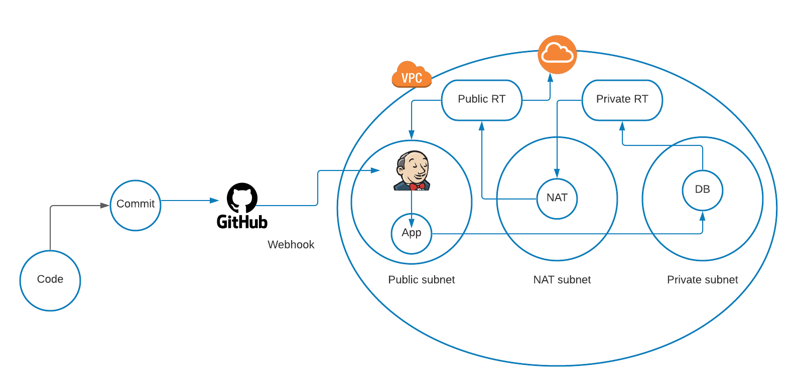

# Building a CI/CD pipeline

## Continuous Integration

Continuous Integration (CI): Developers merge/commit code to master branch multiple times a day, fully automated build and test process which gives feedback within few minutes, by doing so, you avoid the integration hell that usually happens when people wait for release day to merge their changes into the release branch.


## Continuous Delivery

Continuous Delivery is an extension of continuous integration to make sure that you can release new changes to your customers quickly in a sustainable way. This means that on top of having automated your testing, you also have automated your release process and you can deploy your application at any point of time by clicking on a button. In continuous Delivery the deployment is completed manually.

## Continuous Deployment 

Continuous Deployment goes one step further than continuous delivery, with this practice, every change that passes all stages of your production pipeline is released to your customers, there is no human intervention, and only a failed test will prevent a new change to be deployed to production.

## CICD Workflow

How CICD Practices relate to each other: To put it simply, the continuous integration is part of both continuous delivery and continuous deployment. The main difference is the deployment step, in continuous delivery the deployment is done manually and in continuous deployment it happens automatically.
What is a CI CD Pipeline: The CI/CD pipeline is all about automation: Initiating code builds, automated testing, and automated deploying to the staging or production environments. It’s complex and exciting at the same time, but incredibly fast, if the output of any stage fails, the next stage will also fail.

## Docker

Docker is the one of the best virtualization platform to containerise your app, popularity and adoption of Docker is rapidly growing due to its incredible benefits! Top companies like ING, Paypal, ADP, and Spotify keep using Docker. Continuous Integration Efficiency with Docker enables you to build a container image and use that same image across every step of the deployment process. A huge benefit of this is the ability to separate non-dependent steps and run them in parallel, running applications in containers instead of virtual machines is gaining momentum in the IT industry.

## Generating and saving SSH key

- Open git bash
- `ssh-keygen -t rsa -b 4096 -C "your_email@example.com"`
- When you're prompted to "Enter a file in which to save the key," press Enter. This accepts the default file location. 
```
> Enter a file in which to save the key (/c/Users/you/.ssh/id_algorithm):[Press enter]
```

- At the prompt, type a secure passphrase. For more information, see "Working with SSH key passphrases." 

```
> Enter passphrase (empty for no passphrase): [Type a passphrase]
> Enter same passphrase again: [Type passphrase again]
```
- Copy `keyname.pub` into github to create the key (PUBLIC KEY)


- Click on `New SSH Key` and paste the key content

## Setting up Jenkins server

- Create a new instance within your VPC for jenkins server
- I used Ubunt 18.04 AMI 
- Set up Security Group for Jenkins server
- Open port `8080` to access Jenkins
- Port `22` to ssh into the instance


- SSH into your new jenkins instance
- Install Java
- `sudo apt update`
- `sudo apt install openjdk-11-jdk`
- Install Jenkins


```
curl -fsSL https://pkg.jenkins.io/debian-stable/jenkins.io.key | sudo tee \
  /usr/share/keyrings/jenkins-keyring.asc > /dev/null
echo deb [signed-by=/usr/share/keyrings/jenkins-keyring.asc] \
  https://pkg.jenkins.io/debian-stable binary/ | sudo tee \
  /etc/apt/sources.list.d/jenkins.list > /dev/null
sudo apt-get update
sudo apt-get install jenkins
```
- Use `http://publicip:8080` to get into Jenkins interface

## Jenkins plugins

- This job will require following plugis:
    - NodeJS Plugin
    - GitHub Plugin
    - Amazon EC2 Plugin
    - SSH Agent Plugin

## Creating Jenkins jobs

- Create a new to provide jenkis access to your github repo


- Deploy keys
- Create webhook within the same setting page
- `http://publicip:8080/github-webhook/`
- New Item > Freestyle project
- Specify which GitHub repo you will use


